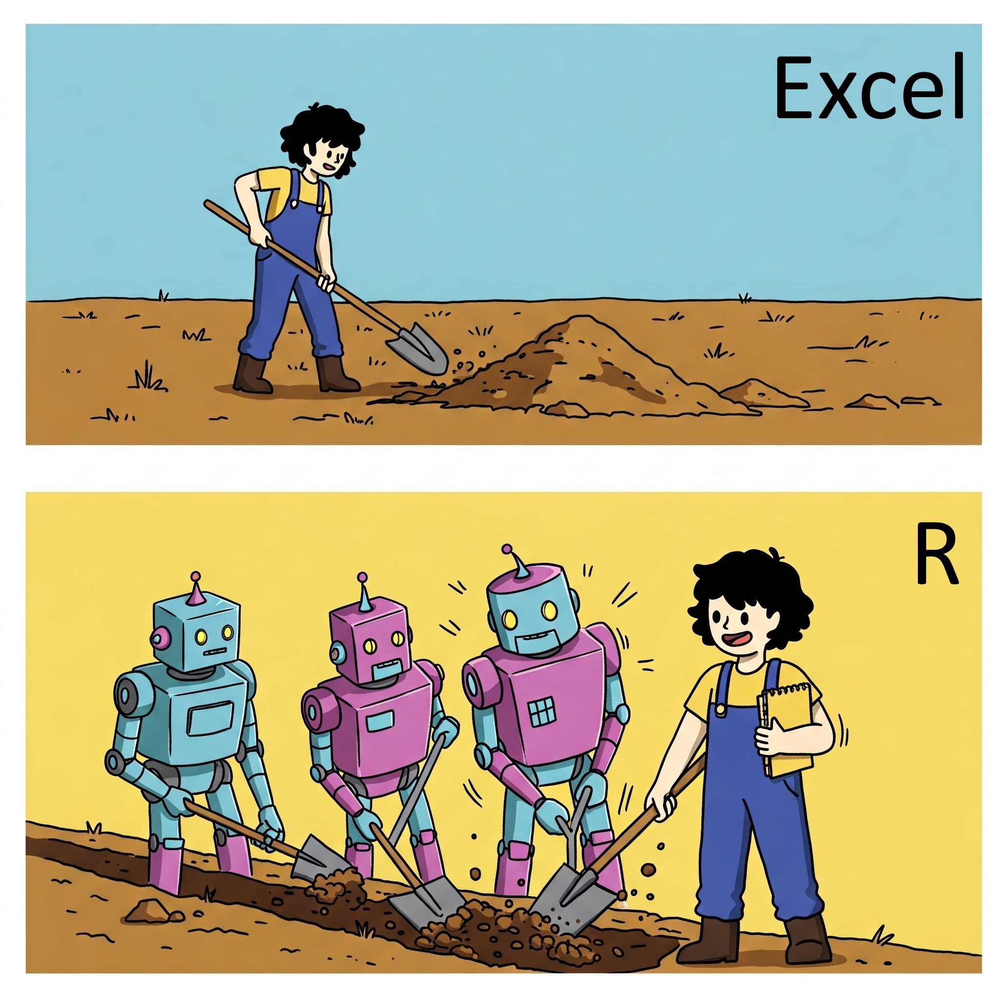

# Day 1

Welcome to the R workshop! This session is designed for complete beginners. Here, you'll learn the basics of R, a powerful tool for data analysis and statistical programming. No prior programming experience is needed. We'll start with simple concepts like variables, functions, and data visualization.

## Conceptual intro to using R

Working in R requires a different mindset than working in something like Excel. In Excel, you're used to clicking around and seeing the results of your actions immediately. In R, you're writing code that tells the computer what to do, because you can't do it yourself. You'll need to get used to writing code and running it to see the results. It's a different way of working, but it's very powerful once you get the hang of it.

One benefit is that you can save your code and run it again later. This is great for reproducibility. You can also share your code with others, who can run it on their own computers. This is great for collaboration. And you can automate repetitive tasks, saving you time and effort. This is great for efficiency.

The big shift in thought you need to make is thinking about using R as **giving instructions to the computer instead of doing it manually**. In R, you are giving a list of tasks to perform on your data. In fact, in R, you can't easily manually change data stored in variables.



Another tough concept to new comers is that you have to think through the order of operations that you need to get to the analysis that you want. You will need to string together multiple instructions to get to the final result. This is a bit like a recipe. You need to do things in the right order to get the final product you want.

Keep in mind in R:
    - The computer holds your data in variables that you can't mess with directly
    - You tell the computer what to do with your data
    - R will do exactly what you tell it to do (not necessarily what you want it to do)
    - **The hardest part of learning R is learning the specific commands to get what you want and how to use them**
        - https://www.youtube.com/watch?v=cDA3_5982h8

## Pep talk

Learning R is hard, but do-able. It takes effort and time and a willingness to move out of your comfort zone. One big thing that will help you learn it is repetition and the best way to get into the habit of using R is to find places where you can use R. As you learn, I would highly encourage you to find places where you are using other tools that can be replaced with R. The more you do it, the faster you'll get comfortable with it.

You're going to see a lot of errors as you get started. That's totally normal, so don't let it discourage you. Everyone runs into errors and one of the most important skills you'll gain as you start is learning how to interpret (and google) error messages.

## Cheat sheets
Find these in the "cheatsheets" folder.

## RStudio overview
### Projects

Projects let you have saved "workspaces" that you can come back to later. This is great for reproducibility and organization. It also lets you switch between projects easily.

### RStudio layout

Turn off workspace saving and loading
- Tools -> Global Options -> General -> Uncheck "Restore .RData into workspace at startup"
- Tools -> Global Options -> General -> Change "Save workspace to .RData on exit" to "Never"
- This seems like it is convenient, but can lead to all sorts of headaches.

### Working directory
When you start RStudio it works in a specific directory. This is where it will look for files if you try to read things in. If you want to read in things, you need to keep in mind that you need to reference where the file is **in relation to where R is working**. If you are in a project, the working directory will be where ever you set it when you set up the project. You can see where R is working from by looking above the console. The files panel on the right does not change the directory you're working in, it just shows you what files and folders are there. You can change your working directory with `setwd("path/to/your/directory")`.

## Rmd format
You are going to want to save your code to a file so you can re-run it later or check what you did during an analysis. There are lots of ways you can do that but the one I'll recommend here is the Rmd (rmarkdown) format. This lets you intersperse your code with text and images and then render it to a nice looking document. You can also render it to a presentation or a website. This is a great way to keep track of what you're doing and share it with others. You can make very fancy reports with Rmd if you want to impress folks, but we'll keep it simple here.

Other file types you may see:
- .R files are just text files with code in it. You can't have prose and code together (kindof).
- .qmd files are a newer format that extends Rmd, but we won't get into that here.

In a Rmd file, all code to be executed is written inside "chunks" which are denoted like this.

```{r}
# your code goes here
# a pound sign (hashtag) in front of text means it won't be executed
lm(mpg ~ wt, data = mtcars)
```
You can put text outside of your code to keep notes or explain things. This makes it very handy for this workshop as I can type all of these notes and keep the code nice and tidy!

## Other key concepts
### What's a variable?
- Data in R is stored in variables. Think of these as buckets of different shapes and sizes that hold data of different types and in different ways.
- Variables come in various types, which we will discuss later. The data inside of these variables also comes in different types such as numbers, text, and logical values which, again, we'll go over later.
- The computer keeps track of your variables for you. They don't persist across sessions (mostly).
- Capitalization matters in R! myVariable is different from MyVariable.
- To create a variable you use the assignment operator `<-` or `=`.
    - `<-` is the preferred way.
    - my_favorite_number <- 42

### What's a function?
- A function is a set of instructions that perform a specific task and can take inputs called arguments. When you do anything in R, you're going to use a function to do it. You'll also hear these referred to as commands. You can think of them as verbs in a sentence. They do things to your data.
- You can tell something is a function because it will be a word followed by parentheses. The word is the name of the function and the stuff inside the parentheses are the arguments.
- The arguments often have names and you set them by using `name = value`. You can also just put the values in the right order and R will figure it out but you need to know the right order. You can also set the arguments to their default values by not setting them at all. Look at the function documentation to see what the default values are.
- When you run a function, it does something and usually returns a new value. If you want to keep that value you'll need to save it to a variable.

`make_a_sandwich(bread_type = "rye", cheese_type = "swiss", add_mayo = TRUE)`
    - `make_a_sandwich` is the name of the function
    - `bread_type`, `cheese_type`, and `add_mayo` are the arguments
    - `"rye"`, `"swiss"`, and `TRUE` are the values of the arguments

`make_a_sandwich("rye", "swiss", TRUE)`
    - This is the same function but the arguments are in the right order

Reading function documentation
- The panel in the bottom right of RStudio will show you the documentation for a function if you type `?function_name` in the console. This will show you what the function does, what arguments it takes, and what the default values are. You can also search for it in the box above the help panel.

Key parts of the help documentation
- Description: What the function does
- Usage: shows how to use the function. 
- **You can also see defaults for arguments here.**
- Arguments: What the arguments are and what they do
- Details: More information about the function
- Value: What the function returns
- Examples: Examples of how to use the function

## Functions for today

### read.delim()
Read a file into your environment. Remember that once you read in the data, you can't manually change it.
This demo shows how read.delim() imports a tab-delimited file into a data frame. Ensure the file path is correct. We save the data in a variable called westernQuant.

```{r readAfile}
westernQuant <- read.delim("materials/westernQuant.txt", header = TRUE)
```

### summary()
Generate summary statistics for a variable.
The summary() function computes descriptive statistics (min, max, median, etc.) for each column in a data frame.

The `mtcars` dataset is a pre-loaded play dataset in R, so we can use it as below.

Note what happens when you run summary() and don't assign the output to a variable. It will print the output to the console. If you assign it to a variable, it will save the output to that variable.
```{r summary}
mtcars <- mtcars

mtcars

mtcars = mtcars
summary(mtcars)
```

### plot()
Visualize data.
This uses plot() to create scatter plots.

For this function, we give it x and y values to make a scatter plot.
`mtcars$mpg` specifies one column of `mtcars`.

The second plot converts the 'cyl' variable to a factor for categorical visualization as a boxplot.
```{r plot}
plot(mtcars$mpg, mtcars$cyl)

plot(as.factor(mtcars$cyl), mtcars$mpg)
```

### boxplot()
Create a boxplot.
This example uses boxplot() to display the distribution of mpg across cylinder groups. The `~` syntax is something you won't see much, but basically means "plot this against that".

```{r}
boxplot(mtcars$mpg ~ mtcars$cyl)
```

### png()/pdf()
Save a plot to an image.
Here, png() saves the plot as an image file and dev.off() closes the file after plotting.

```{r saveAplot}
png(filename = "bob.png")
plot(1, 1)
dev.off()
```

### t.test()
Test for differences between groups.
This section demonstrates t.test() for statistical comparisons: first, comparing two numeric vectors; second, comparing group differences within a dataset.

```{r ttest}
t.test(1:10, y = c(7:20))

# sleep is a pre-loaded dataset in R
sleep

t.test(extra ~ group, data = sleep)
```

## Activity

- Read in “westernQuant.txt” using either read.delim() or the GUI
    - The file can be found in the materials folder. Make sure you tell R where to find it.
    - This is fake data of quantified western blot band intensities
- Use summary() to look at the data
- Use t.test() to test if intensity varies between groups
- Make two plot()s of the two groups
    - Make x-axis group_name for a first plot
    - Make x-axis group_number for a second plot
- Extra task if you're super fast and got done quick
    - Look up wilcox.test() and use it to compare between groups

If you have trouble, look at how I used these functions above as reference, or check out the documentation.

### Read in data
Use read.delim()
```{r readData}

```

### Summarize the data.frame
Use summary()
```{r summaryWestern}

```

### Test for group differences
Use t.test() function
```{r testDiff}

```


### I'm super fast
Help someone around you who may be struggling

Try out wilcox.test()

Try out `hist()` on mtcars$mpg

